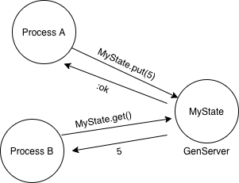
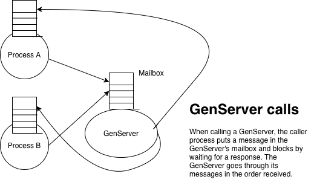
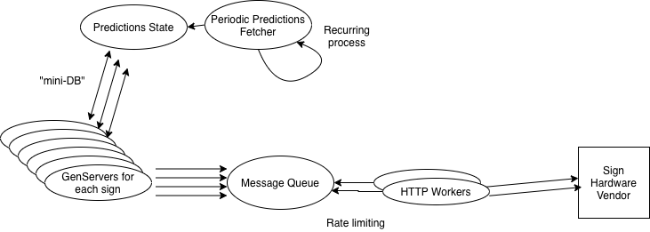

# A GenServer cheat sheet

This README describes what GenServers are and some things they can be useful for. The repo serves as a cheat sheet of "best practices" around using one in an elixir application.

# What is a GenServer

A [GenServer](https://hexdocs.pm/elixir/GenServer.html#content) is an Elixir process that can maintain some state and has a well-defined contract for receiving messages from other processes and responding to them.

GenServers are workhorses of the Elixir world, and are used extensively. I like to think of them as little "bags of state" sitting "over there" doing their own thing, that the rest of your code can periodically ask questions of.



## Code organization vs process organization

First, a very, very brief interlude about a very important point. In Elixir, the _syntactic_ organization of code into modules is very different from the underlying execution in terms of _processes_.

Consider `A` and `B` below. Two different modules. However, in `iex` they're both run in the context of the same process, so they print the same thing. But if you `spawn` a new process, then `A` now prints something different from before.

```elixir
defmodule A do
  def my_pid, do: IO.inspect(self())
end

defmodule B do
  def my_pid, do: IO.inspect(self())
end

iex> A.my_pid()
#PID<0.110.0>

iex> A.my_pid()
#PID<0.110.0>

iex> B.my_pid()
#PID<0.110.0>

iex> spawn(fn -> A.my_pid() end)
#PID<0.129.0>
```

## Starting up a GenServer

Every GenServer will have the following two functions defined in order to start it up. Keep in mind the code vs process distinction above; one function is run by the Supervisor, the other function from "within" the GenServer process.

```elixir
defmodule MyGenServer do
  use GenServer

  # function run by the Supervisor, e.g. from Application's `children = [ {MyGenServer, args}]`
  def start_link(_args) do
    IO.inspect(self()) # The Supervisor's pid
    GenServer.start_link(__MODULE__, [], [])
  end

  # This callback is run from "within" the GenServer process.
  def init([]) do
    IO.inspect(self()) # The GenServer's pid
    # The tuple's second element is the initial state of the GenServer
    {:ok, []}
  end

  # ...
end
```

## Interacting with a GenServer

Once the GenServer is up and running, it's time to interact with it. The primary way of interacting is via sending messages and getting responses. That's a synchronous "call". There's also an async "cast" which should never be used.



```elixir
# sends a normal message:
iex> send(pid, {:new_integer, 5})
{:new_integer, 5}

iex> receive do
...    :some_response -> ...
...  end
# ... sits and waits

# sends a message, sets up tracing, waits for response
iex> GenServer.call(pid, :foo)
```

When you write a GenServer, you define callbacks that "listen for" all the calls that you expect.

```elixir
defmodule MyGenServer do
  # ... init / start_link, etc

  def handle_call({:new_integer, n}, from, state) do
    IO.inspect(from) # The caller's pid and other stuff
    IO.inspect(self()) # The GenServer's pid

    {:reply, :got_your_n!, [n | state]}
  end
end

iex> {:ok, pid} = MyGenServer.start_link()

iex> GenServer.call(pid, {:new_integer, 10})
:got_your_n!
```

Notice the coupling of the `{:new_integer, 5}` tuple. That particular format is what the GenServer is listening for, and also what you have to send. For this reason, people usually wrap the GenServer call in a function in the GenServer module. However, as always, keep in mind the _code organization_ vs _process organization_ point from above! While the code is in the GenServer's module, it's still being run by the calling process.

```elixir
defmodule MyGenServer do
  #... start_link / init, etc...

  # we call this the "client" part of the GenServer, since it's the interface callers should use
  def new_integer(pid, 5) do
    IO.inspect(self()) # the PID of the caller
    GenServer.call(pid, {:new_integer, 5})
  end

  # we call this the "server" part of the GenServer, since it's running inside the GenServer process
  def handle_call({:new_integer, n}, _from, state) do
    IO.inspect(self()) # the PID of the GenServer
    {:reply, :got_your_n!, [n | state]}
  end
end

iex> {:ok, pid} = MyGenServer.start_link()

iex> MyGenServer.new_integer(pid, 5)
:got_your_n!
```

## Naming your GenServer

Notice that in these examples you need to know the `pid` in order to send a message to the GenServer. Often, in a typical application, there's only going to be one instance of each kind of GenServer, and other processes won't have been around to see the `pid` returned by the `start_link`. In such cases, the GenServer is typically given a name when it starts up, and then other processes can either use this name, or the name can be provided by the "client" functions by default.

```elixir
defmodule MyGenServer do
  def start_link(opts \\ []) do
    name = Keyword.get(opts, :name, __MODULE__)
    GenServer.start_link(__MODULE__, [], name: name)
  end
end

iex> {:ok, _pid} = MyGenServer.start_link()

iex> GenServer.call(MyGenServer, {:some_message, 10})
```

And if you give it the name `__MODULE__` (i.e.: `MyGenServer` in this case), then you can provide that as a default argument to the client functions, so clients don't need to specify a name or PID when calling the "main" instance of this GenServer (as opposed to, e.g., an instance in the test suite).

```elixir
defmodule MyGenServer do
  # start_link, as above...

  def new_integer(pid \\ __MODULE__, 5) do
    GenServer.call(pid, {:new_integer, 5})
  end
end

# in a test:
iex> {:ok, pid} = MyGenServer.start_link(name: :my_test_genserver)
iex> MyGenServer.new_integer(:my_test_genserver, 5)
iex> MyGenServer.new_integer(pid, 5)

# in production code, e.g., from another process:
iex> MyGenServer.new_integer(12)
```

# What are GenServers used for?

GenServers are useful for many things. In my experience I've created GenServers primarily for the following uses:

## Little in memory "mini-DBs".

GenServers can maintain their own state. They can also be given a name when they start up, which makes it easy for code and processes throughout your app to ask them things. In the example below, `FavoriteNumbers` is a GenServer exposing an interface that lets clients manipulate its state in defined ways, as well as query that state.

```ex
iex> FavoriteNumbers.reset()
[]
iex> FavoriteNumbers.add(5)
5
iex> FavoriteNumbers.add(7)
7
iex> FavoriteNumbers.all()
[5, 7]
iex> FavoriteNumbers.is_favorite?(7)
true
iex> FavoriteNumbers.is_favorite?(11)
false
```

On the TRC team some examples of GenServers serving this function are ones that keep track of where subway vehicles are and ones that keep track of what's on the countdown clocks at stations.

## Recurring processes

GenServers are great to use with `:timer.send_interval/3`, which sends a process a message on a repeated basis. In this case, the GenServer is the stand alone process, and it also effectively sends _itself_ messages every so often, rather than simply being there to respond to other processes.

```elixir
defmodule MyGenServer do
  # start_link...

  def init(_arg) do
    # on GenServer init, set up a 1/min timer to send self :do_thing
    :timer.send_interval(60_000, self(), :do_thing)
  end

  # handle the message you receive (note: handle_info, not handle_call)
  def handle_info(:do_thing, state) do
    # do some work
    {:noreply, state}
  end
end
```

On the TRC team some examples of this usage are periodic downloading of predictions to sample for accuracy, hourly calculation of those accuracy metrics, or checking for new alerts to update predictions.

## Rate limiting, enforcing an order

Another common use case is to wrangle Elixir's concurrency into synchronous action, where required, by sending requests to a GenServer (or set of GenServers) which will process the messages it receives in order.

## Example of all three uses

The TRC team's Realtime Signs application has examples of all three uses. Here is a pared down version of some of the GenServer processes in the application.



Notice:

- There is a recurring process that fetches predictions every couple seconds.
- There is a "mini-DB" of predictions, updated by the above process, and queried by the signs' GenServers. (Though this is actually a set of ETS tables managed by this GenServer now, for performance reasons.)
- There is a rate-limiting Message Queue that all the signs are channeled through, so as to not overwhelm our upstream server.

# Best practices with using GenServers

This repo is an example of adding a single GenServer into the supervision tree and testing it. Here are some of the key points.

## All GenServers in the Supervision tree

Every GenServer should be started by a Supervisor in the supervision tree. For instance, here's how you add one to the main Application supervisor:

```elixir
defmodule MyApplication do
  use Application

  @impl true
  def start(_type, _args) do
    children = [
      {MyGenServer, some_arg: :some_value}
    ]
    opts = [strategy: :one_for_one, name: MyApp.Supervisor]
    Supervisor.start_link(children, opts)
  end
end
```

## Use a struct for the GenServer's state

In my experience, the state of the GenServer continues to grow over time, in terms of what it's keeping track of, as well as ways it can be configured. Given that, I think it's usually best to just start with a struct right off the bat.

```elixir
defmodule MyGenServer do
  use GenServer

  @enforce_keys [:some_di_mod, :some_config]
  defstruct @enforce_keys ++ [:optional, optional_with_default: 60]

  @type state :: %__MODULE__{
    some_di_mod: module(),
    some_config: integer(),
    optional: integer() | nil,
    optional_with_default: integer()
  }

  def init(arg) do
    #...
    {:ok, %__MODULE__{...}}
  end
end
```

## Dependency injection, via modules, in state

Most useful GenServers will need some level of dependency injection. The production version might periodically make an HTTP request, but for the test suite you'll likely not want to always make live requests, and you might want control over the response.

### Use a @behaviour and have DI modules

Do dependency injection at the module level, and specify a `@behaviour` to enforce the contract. In the example here, the production module generates random numbers. However, that's hard to test, so two "fake" modules are provided that always generate either an error or a known random number.

```elixir
defmodule Demo.Fetcher do
  @callback fetch() :: {:ok, integer()} | :error
end

defmodule Demo.Fetcher.RandomGen do
  @behaviour Demo.Fetcher

  @impl Demo.Fetcher
  def fetch do
    num = floor(:rand.uniform() * 10)

    if num > 0 do
      {:ok, num}
    else
      :error
    end
  end
end

defmodule FakeRandomIntsFetcher do
  @behaviour Demo.Fetcher

  def fetch(), do: {:ok, 5}
end

defmodule FakeRandomIntsErrorFetcher do
  @behaviour Demo.Fetcher

  def fetch(), do: :error
end
```

### Use Application.get_env/2 in the Supervisor

With the above modules, you can configure the app to use them in the config:

**config/config.exs**

```elixir
import Config
config :demo, fetch_mod: Demo.Fetcher.RandomGen
```

But then read the config in the _supervisor_ and pass the value into the GenServer as an argument.

```elixir
defmodule Demo.Application do
  # ...
  def start(_type, _args) do
    fetch_mod = Application.get_env(:demo, :fetch_mod)

    children = [
      {Demo.RandomInts, fetch_mod: fetch_mod}
    ]
    # ...
  end
end
```

This keeps all the configuration in one place. Another option would be to do this in the GenServer's `start_link` function. But the main point is for the _calling process_ to do it and pass it in, not for the GenServer itself to do `Application.get_env/2`, because then testing can't be async since you'll need to modify the global Application state.

### The GenServer stores the module in its state

```elixir
defmodule Demo.RandomInts do
  use GenServer

  def init(args) do
    fetch_mod = Keyword.fetch!(args, :fetch_mod)
    :timer.send_interval(repeat_ms, self(), :do_fetch)
    {:ok, %__MODULE__{fetch_mod: fetch_mod}}
  end

  def handle_info(:do_fetch, state) do
    case state.fetch_mod.fetch() do
      {:ok, n} ->
        Logger.info("fetched #{n}")
        {:noreply, %{state | ints: [n | state.ints]}}

      :error ->
        Logger.warn("got an error this time")
        {:noreply, state}
    end
  end
```

### The GenServer can be tested via "sideloading"

If the "client" function is literally nothing more than an invocation of GenServer.call (as is the goal), very little is gained from exercising the whole GenServer process. Instead, it's faster and easier and usually sufficient to test the callback "directly" in the context of the test process, with a provided state.

While `handle_call` and `handle_info` are _meant_ to be callbacks invoked by the GenServer itself, ultimately they're simply functions in that module and can be tested like any other pure Elixir function.

```elixir
defmodule Demo.RandomIntsTest do
  use ExUnit.Case, async: true
  alias Demo.RandomInts

  @state %Demo.RandomInts{
    fetch_mod: FakeRandomIntsFetcher
  }

  describe "seen_number?/1" do
    test "returns true if the number is in the state" do
      state = %{@state | ints: [10, 5]}
      assert {:reply, true, ^state} = RandomInts.handle_call({:seen_number?, 10}, self(), state)
    end

    test "returns false if the number is not in the state" do
      state = %{@state | ints: [10, 5]}
      assert {:reply, false, ^state} = RandomInts.handle_call({:seen_number?, 7}, self(), state)
    end
  end
```

# "Gotchas" to watch out for

The biggest thing to watch out for is the GenServer timing out. If a process calls `MyGenServer.do_a_thing()`, then that process will wait for a while (default of 5 seconds) before timing out and blowing up. Importantly, a GenServer answers messages in the order it receives them, so if a GenServer's `handle_call/3` callback is too slow relative to the number of requets it gets, the mailbox can backup and eventually calling processes can time out. This is "backpressure" and sometimes necessary.

One situation that has caused us trouble before is when a GenServer is used _both_ in the "recurring process" sense (perhaps fetching some data from a URL every so often) _and_ a "mini DB" sense, answering questions about that state from other processes. In that situation, HTTP requests can take a couple seconds or more, and so while the GenServer is doing that (if it's part of the `handle_info` callback), "mini DB" type requests will back up. We've fixed this in the past by introducing _another_ process that actually does the download and then sends a message to the GenServer once it's complete, with the data, so the GenServer isn't blocked while waiting on the request.
